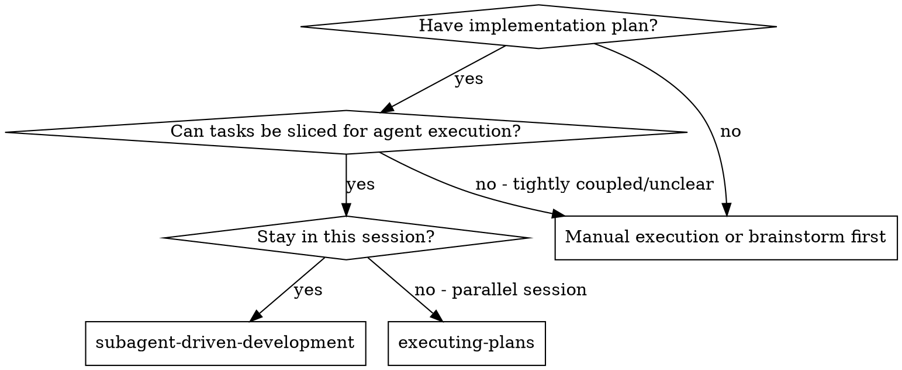
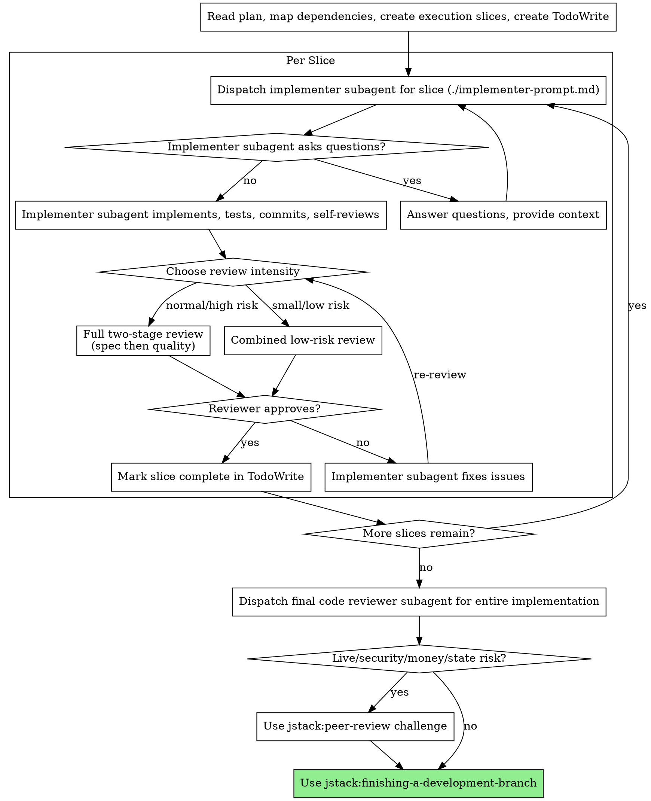

# Subagent-Driven Development

Execute plan by dispatching subagents for coherent task slices, with review gates sized to risk: spec compliance before code quality for high-risk or isolated slices; combined review for small low-risk slices.

**Why subagents:** You delegate task slices to specialized agents with curated context. By precisely crafting their instructions and context, you ensure they stay focused and succeed. They should never inherit your session's context or history — you construct exactly what they need. This also preserves your own context for coordination work.

**Core principle:** The orchestrator owns dependency judgment. Use the smallest isolated subagent slice that preserves correctness, then apply the review intensity the risk deserves.

## When to Use



**vs. Executing Plans (inline or separate owner):**
- Same session (no context switch)
- Fresh or grouped subagent slices selected by the orchestrator (controlled context)
- Review gates after each slice, with two-stage review when risk warrants it
- Faster iteration (no human-in-loop between tasks)

## Orchestration Strategy

Before dispatching any implementer, the orchestrator MUST read the whole plan and convert plan tasks into execution slices. A slice may be one task, part of a task, or a small group of dependent tasks.

**Use one fresh subagent per task when:**
- Tasks modify disjoint files or modules.
- Each task has a clear independent test target.
- The next task only depends on the previous task's committed public interface.
- A fresh context reduces risk more than it loses continuity.

**Group multiple tasks into one subagent slice when:**
- Tasks share the same files and would cause merge churn if split.
- Later steps require implementation details from earlier steps, not just public interfaces.
- The task boundary is artificial and splitting would force repeated rediscovery.
- The combined slice remains small enough for one agent to understand and verify.

**Split a plan task into smaller slices when:**
- It touches unrelated files or subsystems.
- It has separable tests that can pass independently.
- The implementer would need to hold too many details in context.
- Reviewers would struggle to distinguish spec compliance from code quality.

**Switch to inline execution instead when:**
- Almost every task depends on hidden state from the previous one.
- The work is diagnosis/debugging where test output changes the next step.
- The environment depends on live services, credentials, long-running processes, or shared local state.
- Slicing would create more coordination cost than implementation cost.

Record the chosen slices in TodoWrite with enough detail to show why each slice is isolated, grouped, or split.

## Review Intensity

Pick the review gate per slice. Do not skip review; choose the right size.

**Full two-stage review (default for non-trivial work):**
- Spec compliance reviewer first.
- Code quality reviewer only after spec compliance passes.
- Use for high-risk behavior, security/auth/live/money/state surfaces, cross-module changes, public APIs, data migrations, or any slice where over/under-building would be costly.

**Combined review (allowed for low-risk slices):**
- One reviewer checks both spec compliance and code quality in a single pass.
- Use only for small, low-risk slices touching 1-2 files with targeted tests and no public API, migration, security, live, money, or state-machine risk.
- The reviewer prompt must explicitly check: missing requirements, extra scope, test quality, maintainability, file responsibility, and targeted verification evidence.

**Final review remains required:**
- After all slices complete, run a final code review for the entire implementation.
- If live/security/money/state risk exists, run `jstack:peer-review challenge` before finishing.

## The Process



## Model Selection

Use the least powerful model that can handle each role to conserve cost and increase speed.

Implementation agents should default to an implementation-tier model roughly
equivalent to `gpt-5.4` with `medium` or `low` reasoning, regardless of whether
the host is Codex or Claude Code. Reserve top-tier reviewer models for review,
architecture, and adversarial work. In practice, prefer `-m gpt-5.4` for Codex
implementers and `--model claude-sonnet-4-6` for Claude implementers.

When generating Codex implementer commands, prefer `-m gpt-5.4`. Default to
`-c 'model_reasoning_effort="medium"'` for normal implementation and drop to
`-c 'model_reasoning_effort="low"'` for mechanical tasks, fast probes, or
tightly scoped follow-up fixes. When generating Claude implementer commands,
prefer `--model claude-sonnet-4-6` with `--effort medium`, dropping to
`--effort low` for mechanical tasks. If the user asks for a fast Codex
execution path, also add `-c 'service_tier="fast"'`. Only escalate above this
lane for architecture, security, live-risk, release-blocking, or broad
integration tasks.

**Mechanical implementation tasks** (isolated functions, clear specs, 1-2 files): use an implementation-tier model with `low` reasoning. Most implementation tasks are mechanical when the plan is well-specified.

**Integration and judgment tasks** (multi-file coordination, pattern matching, debugging): use an implementation-tier model with `medium` reasoning.

**Architecture, design, and review tasks**: use the most capable available model.

**Task complexity signals:**
- Touches 1-2 files with a complete spec → `gpt-5.4`-class model, `low` reasoning
- Touches multiple files with integration concerns → `gpt-5.4`-class model, `medium` reasoning
- Requires design judgment or broad codebase understanding → most capable model

## Resource Budget and Agent Cleanup

This workflow optimizes quality by creating many fresh agents. Without explicit resource
limits, complex plans can saturate CPU because multiple agents may run searches, tests,
typechecks, linters, language servers, or MCP-backed tooling at the same time.

**Default conservative budget:**
- Execute one slice at a time.
- Max running subagent calls: **1**. Do not dispatch another agent while one is actively working.
- Max open subagent sessions: **2** for the current slice only (the slice implementer plus the current reviewer/fixer). Close/reap reviewers immediately after their result is processed.
- Keep at most one task implementer alive through the review/fix loop. Close/reap it after code quality approval or after the task is abandoned.
- Do not start the next slice until the current slice's implementer and reviewers are closed/reaped or explicitly known idle.
- If the runtime supports explicit agent cleanup, call it after every completed reviewer and after each completed slice.

**Hard limits:**
- No nested subagents. Every implementer/reviewer prompt must say: "Do not spawn subagents or parallel agents; escalate instead."
- No parallel implementers, no parallel reviewers for the same slice, and no pre-dispatching the next slice while review is still open.
- Stop using this workflow as-is when expected invocations exceed ~12 (for example, too many slices with separate implementer/reviewer cycles) or when review loops repeat twice on one slice. Re-plan into smaller batches or switch to a single-owner/manual execution lane.
- If system CPU is saturated, pause dispatching new agents. Wait for current work to finish, then continue in conservative mode or reduce the workflow to one implementer plus final review.

**Command budget for all agents:**
- Prefer targeted tests for the files/behavior touched by the current slice.
- Run full lint/typecheck/test only at task boundaries when necessary and at final verification; never let multiple agents run full-suite verification concurrently.
- Use non-watch commands (`CI=1` where applicable). Do not run dev servers, file watchers, or long-running background commands unless the task explicitly requires them.
- If a server/watch/background command is unavoidable, the agent must record its PID, explain why it was needed, and stop it before reporting DONE.
- Avoid broad repo scans when focused file/symbol searches are enough.

**Interruption and cleanup protocol:**
- Maintain a small ledger while running this workflow: task, role, agent id/session id if available, status, started time, cleanup status, and any background PIDs the agent reports.
- On user interruption, stop dispatching new agents immediately.
- Do not kill processes by broad names like `codex`, `node`, `tmux`, or `omx`. Only close/terminate agents or PIDs that are recorded in the ledger and belong to this workflow/session/worktree.
- If ownership is uncertain, report the suspected leftover agents/processes and leave them running rather than risking another user's or another session's work.
- Before final completion, verify the ledger has no running agents, no unclosed reviewers, and no known background commands.

## Handling Implementer Status

Implementer subagents report one of four statuses. Handle each appropriately:

**DONE:** Proceed to the chosen review gate for the slice.

**DONE_WITH_CONCERNS:** The implementer completed the work but flagged doubts. Read the concerns before proceeding. If the concerns are about correctness or scope, address them before review. If they're observations (e.g., "this file is getting large"), note them and proceed to review.

**NEEDS_CONTEXT:** The implementer needs information that wasn't provided. Provide the missing context and re-dispatch.

**BLOCKED:** The implementer cannot complete the task. Assess the blocker:
1. If it's a context problem, provide more context and re-dispatch with the same model
2. If the task requires more reasoning, re-dispatch with a more capable model
3. If the task is too large, break it into smaller pieces
4. If the plan itself is wrong, escalate to the human

**Never** ignore an escalation or force the same model to retry without changes. If the implementer said it's stuck, something needs to change.

## Prompt Templates

- `./implementer-prompt.md` - Dispatch implementer subagent
- `./spec-reviewer-prompt.md` - Dispatch spec compliance reviewer subagent
- `./code-quality-reviewer-prompt.md` - Dispatch code quality reviewer subagent

For combined low-risk review, use one reviewer with both the slice requirements and the diff range. The prompt must say:

```text
Review this low-risk implementation slice for both spec compliance and code quality.
Check for missing requirements, extra scope, test quality, maintainability, file
responsibility, and targeted verification evidence. Findings first with file:line
references. Do not edit files. Do not spawn subagents.
```

## Example Workflow

```
You: I'm using Subagent-Driven Development to execute this plan.

[Read plan file once: docs/jstack/plans/feature-plan.md]
[Map dependencies, convert tasks into execution slices, create TodoWrite]

Slice 1: Hook installation script

[Get Slice 1 text and context (already extracted)]
[Dispatch implementation subagent with full task text + context]

Implementer: "Before I begin - should the hook be installed at user or system level?"

You: "User level (~/.config/jstack/hooks/)"

Implementer: "Got it. Implementing now..."
[Later] Implementer:
  - Implemented install-hook command
  - Added tests, 5/5 passing
  - Self-review: Found I missed --force flag, added it
  - Committed

[Dispatch spec compliance reviewer]
Spec reviewer: ✅ Spec compliant - all requirements met, nothing extra

[Get git SHAs, dispatch code quality reviewer]
Code reviewer: Strengths: Good test coverage, clean. Issues: None. Approved.

[Mark Slice 1 complete]

Slice 2: Recovery modes

[Get Slice 2 text and context (already extracted)]
[Dispatch implementation subagent with full task text + context]

Implementer: [No questions, proceeds]
Implementer:
  - Added verify/repair modes
  - 8/8 tests passing
  - Self-review: All good
  - Committed

[Dispatch spec compliance reviewer]
Spec reviewer: ❌ Issues:
  - Missing: Progress reporting (spec says "report every 100 items")
  - Extra: Added --json flag (not requested)

[Implementer fixes issues]
Implementer: Removed --json flag, added progress reporting

[Spec reviewer reviews again]
Spec reviewer: ✅ Spec compliant now

[Dispatch code quality reviewer]
Code reviewer: Strengths: Solid. Issues (Important): Magic number (100)

[Implementer fixes]
Implementer: Extracted PROGRESS_INTERVAL constant

[Code reviewer reviews again]
Code reviewer: ✅ Approved

[Mark Slice 2 complete]

...

[After all tasks]
[Dispatch final code-reviewer]
Final reviewer: All requirements met, ready to merge

Done!
```

## Advantages

**vs. Manual execution:**
- Subagents follow TDD naturally
- Fresh or intentionally grouped context per slice (less confusion)
- Parallel-safe (subagents don't interfere)
- Subagent can ask questions (before AND during work)

**vs. Executing Plans:**
- Same session (no handoff)
- Continuous progress (no waiting)
- Review checkpoints automatic

**Efficiency gains:**
- No file reading overhead (controller provides full text)
- Controller curates exactly what context is needed
- Subagent gets complete information upfront
- Questions surfaced before work begins (not after)

**Quality gates:**
- Self-review catches issues before handoff
- Review intensity matches slice risk
- Review loops ensure fixes actually work
- Spec compliance prevents over/under-building
- Code quality ensures implementation is well-built

**Cost:**
- More subagent invocations than inline execution
- Controller does more prep work (extracting all tasks upfront)
- Review loops add iterations
- But catches issues early (cheaper than debugging later)

## Red Flags

**Never:**
- Start implementation on main/master branch without explicit user consent
- Skip reviews (spec compliance OR code quality)
- Proceed with unfixed issues
- Dispatch multiple implementation subagents in parallel (conflicts)
- Dispatch new agents while a previous subagent is still actively running
- Leave completed reviewer agents open after their result is processed
- Let subagents spawn their own subagents or parallel agents
- Let multiple agents run full-suite tests/typechecks/lints concurrently
- Kill broad process classes (`codex`, `node`, `tmux`, `omx`) instead of only recorded workflow-owned PIDs/agents
- Make subagent read plan file (provide full text instead)
- Skip scene-setting context (subagent needs to understand where task fits)
- Ignore subagent questions (answer before letting them proceed)
- Accept "close enough" on spec compliance (reviewer found issues = not done)
- Skip review loops (reviewer found issues = implementer fixes = review again)
- Let implementer self-review replace actual review (both are needed)
- **Start code quality review before spec compliance is approved in full two-stage mode** (wrong order)
- Use combined review for high-risk or public API/security/live/money/state-machine slices
- Move to next slice while review has open issues

**If subagent asks questions:**
- Answer clearly and completely
- Provide additional context if needed
- Don't rush them into implementation

**If reviewer finds issues:**
- Implementer (same subagent) fixes them
- Reviewer reviews again
- Repeat until approved
- Don't skip the re-review

**If subagent fails task:**
- Dispatch fix subagent with specific instructions
- Don't try to fix manually (context pollution)

## Final Peer Review Challenge

After final code review and before finishing the branch, decide whether the
implementation touched live/security/money/state-risk surfaces. Use
`jstack:peer-review challenge` when the work affects:

- Live trading, live-smoke, transfers, deposits, withdrawals, bridge execution, or signer paths
- Authentication, callback signing, nonce/replay handling, permissions, secrets, or allowlists
- Exchange adapter state mapping, order/account state machines, idempotency, recovery, or reconciliation
- Deployment, migrations, irreversible data changes, or release blockers

The challenge reviewer is read-only. Apply accepted fixes only after verifying each
finding against code/tests/logs, then re-run targeted verification. Do not run live
execution, spend funds, or change live positions without explicit user confirmation.

## Integration

**Required workflow skills:**
- **jstack:using-git-worktrees** - REQUIRED: Set up isolated workspace before starting
- **jstack:writing-plans** - Creates the plan this skill executes
- **jstack:requesting-code-review** - Code review template for reviewer subagents
- **jstack:finishing-a-development-branch** - Complete development after all tasks
- **jstack:peer-review** - REQUIRED for final adversarial challenge when live/security/money/state-risk surfaces changed

**Subagents should use:**
- **jstack:test-driven-development** - Subagents follow TDD for each task

**Alternative workflow:**
- **jstack:executing-plans** - Use for parallel session instead of same-session execution
